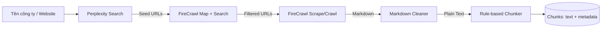

# CleanerRawData – Backend

Pipeline thu thập & tiền xử lý dữ liệu công ty từ web để chuẩn bị cho RAG / vector DB.

> **Input:** tên công ty hoặc website  
> **Output:** danh sách `chunks` (đoạn văn ngắn, đã làm sạch, kèm metadata) sẵn sàng đưa vào vector DB hoặc pipeline embedding.

---

## 1. Mục tiêu

Khi xây dựng một hệ thống RAG / chatbot tra cứu thông tin doanh nghiệp, chúng ta cần một nguồn dữ liệu **sạch, có cấu trúc, tách đoạn ổn định**. Demo này tự động hoá toàn bộ luồng:

1. **Tìm URL** liên quan đến công ty (Perplexity Search).
2. **Mở rộng URL** sang các trang con có dữ liệu thực sự (FireCrawl `/map` + `search`).
3. **Crawl HTML → Markdown** (FireCrawl `/scrape` hoặc `/crawl`).
4. **Làm sạch Markdown → Plain Text** (loại bỏ navigation, ads, footer, link rác…).
5. **Rule-based Chunking** – cắt theo heading + câu + overlap.

---

## 2. Pipeline tổng quan



| Bước | Module                | Công cụ chính                     | Input                | Output                         |
|------|-----------------------|------------------------------------|----------------------|--------------------------------|
| 1    | `search/perplexity_search` | Perplexity Search API (`search.create`) | Tên/URL công ty | List seed URL          |
| 2    | `discover/firecrawl_map` | FireCrawl `/map` (`search` param) | Domain               | List URL có data                |
| 3    | `crawl/firecrawl`     | FireCrawl `/scrape` hoặc `/crawl`  | URL                  | Markdown + metadata            |
| 4    | `clean/markdown`      | `strip_markdown` + `filter_blocks` + `dedup_blocks` | Markdown | Plain text đã làm sạch |
| 5    | `chunk/rule_based`    | heading heuristic + sentence overlap   | Plain text          | List `Chunk(text, metadata)`   |

---

## 3. Cấu trúc thư mục đề xuất

```
CleanerRawDataBe/
├── README.md
├── requirements.txt
├── .env.example
├── docs/
│   ├── ARCHITECTURE.md        # Kiến trúc & quyết định thiết kế
│   ├── PIPELINE.md            # Chi tiết từng bước, ví dụ I/O
│   ├── API_KEYS.md            # Cách lấy & cấu hình API keys
│   └── IMPLEMENTATION_PLAN.md # Kế hoạch triển khai từng phase
├── app/
│   ├── __init__.py
│   ├── config.py              # Load .env, settings
│   ├── pipeline.py            # Orchestrator gọi 5 bước
│   ├── search/
│   │   └── perplexity_search.py
│   ├── discover/
│   │   └── firecrawl_map.py
│   ├── crawl/
│   │   └── firecrawl_scrape.py
│   ├── clean/
│   │   └── markdown_cleaner.py
│   ├── chunk/
│   │   └── rule_based_chunker.py
│   └── models.py              # Pydantic models (SeedURL, Page, Chunk…)
├── tests/
│   └── ...
└── examples/
    ├── check_phase1.py        # Smoke test Phase 1 (config + models)
    ├── check_phase2.py      # Smoke test Phase 2 (Perplexity → SeedURL)
    ├── check_phase3.py      # Smoke test Phase 3 (FireCrawl map)
    ├── check_phase4.py      # Smoke test Phase 4 (FireCrawl scrape → RawPage)
    ├── check_phase5.py      # Smoke test Phase 5 (cleaner → CleanedPage)
    ├── check_phase6.py      # Smoke test Phase 6 (chunker → Chunk)
    └── run_demo.py            # Chạy thử end-to-end (khi pipeline xong)
```

---

## 4. Yêu cầu hệ thống

- Python **3.10+**
- Tài khoản & API key của:
  - **Perplexity** – [https://www.perplexity.ai/settings/api](https://www.perplexity.ai/settings/api)
  - **FireCrawl** – [https://www.firecrawl.dev/app/api-keys](https://www.firecrawl.dev/app/api-keys)
- (Tuỳ chọn) Redis / SQLite để cache kết quả crawl.

---

## 5. Cài đặt

```bash
git clone <repo>
cd CleanerRawDataBe

python -m venv .venv
.\.venv\Scripts\Activate.ps1     # Windows PowerShell
# source .venv/bin/activate      # macOS/Linux

pip install -r requirements.txt
cp .env.example .env             # rồi điền API keys
```

Xem chi tiết cấu hình API keys ở [`docs/API_KEYS.md`](docs/API_KEYS.md).

---

## 6. Kiểm tra Phase 1 (config + Pydantic models)

Phase 1 kiểm tra: load `Settings` từ `.env` và khởi tạo được các model (`SeedURL`, `DiscoveredURL`, `RawPage`, `CleanedPage`, `Chunk`, `PipelineResult`). Script **không** gọi API bên ngoài; chỉ cần hai biến môi trường tồn tại (có thể dùng giá trị placeholder khi test local).

**Điều kiện:** đã cài `requirements.txt`, đã có file `.env` với ít nhất:

```env
PERPLEXITY_API_KEY=pplx-...   # hoặc tạm "demo" khi chỉ test import
FIRECRAWL_API_KEY=fc-...      # hoặc tạm "demo"
```

**Chạy từ thư mục gốc repo** (`CleanerRawDataBe/`):

```powershell
python examples/check_phase1.py
```

Script tự thêm thư mục gốc vào `sys.path`, nên thường **không cần** `PYTHONPATH`. Nếu vẫn lỗi import, thử:

```powershell
$env:PYTHONPATH = "."   # PowerShell
# export PYTHONPATH=.   # macOS/Linux
python examples/check_phase1.py
```

**Kết quả mong đợi** (rút gọn):

```
Settings loaded successfully.
OUTPUT_DIR=./out
HTTP_TIMEOUT=60
Model instantiation successful.
PipelineResult chunks=1
```

Nếu báo `ModuleNotFoundError: No module named 'app'`, kiểm tra đang đứng ở thư mục gốc `CleanerRawDataBe` (cùng cấp với thư mục `app/`), rồi thử `PYTHONPATH=.` như trên.

Chi tiết kế hoạch triển khai: [`docs/IMPLEMENTATION_PLAN.md`](docs/IMPLEMENTATION_PLAN.md).

### 6.1. Kiểm tra Phase 2 (Perplexity Search → `SeedURL`)

Cần **`PERPLEXITY_API_KEY` thật** (Phase 1 chỉ cần placeholder; Phase 2 gọi API). Tùy chọn trong `.env`: `PERPLEXITY_MAX_SEARCH_RESULTS`, `PERPLEXITY_VERIFY_HTTP` (xem [`docs/API_KEYS.md`](docs/API_KEYS.md)).

```powershell
python examples/check_phase2.py --company "FPT Software" --website "fptsoftware.com"
```

Tùy chọn nhanh khi debug (bỏ kiểm tra HTTP / mở rộng domain):

```powershell
python examples/check_phase2.py --company "FPT Software" --website "fptsoftware.com" --no-verify
python examples/check_phase2.py --company "FPT Software" --no-domain-filter
```

### 6.2. Kiểm tra Phase 3 (FireCrawl `map` → `DiscoveredURL`)

Cần **`FIRECRAWL_API_KEY` thật**. Gọi map từ danh sách seed (mặc định: Phase 2 qua Perplexity + website), hoặc chỉ website:

```powershell
python examples/check_phase3.py --company "FPT Software" --website "fptsoftware.com"
python examples/check_phase3.py --website "fptsoftware.com" --no-search
```

Tùy chọn: `--limit 30`, `--include-subdomains`, `--manual https://...`.

### 6.3. Kiểm tra Phase 4 (FireCrawl `scrape` → `RawPage`)

Cần **`FIRECRAWL_API_KEY` thật**. Hoặc chỉ định URL, hoặc map (giống Phase 3) rồi scrape tối đa `--scrape-limit` URL đầu:

```powershell
python examples/check_phase4.py --url "https://example.com"
python examples/check_phase4.py --website "fptsoftware.com" --no-search --scrape-limit 8
python examples/check_phase4.py --company "FPT Software" --website "fptsoftware.com" --scrape-limit 5
```

Tùy chọn: `--map-limit`, `--concurrency`, `--include-subdomains`. Trong `.env`: `FIRECRAWL_SCRAPE_CONCURRENCY`, `FIRECRAWL_SCRAPE_WAIT_MS`, `FIRECRAWL_SCRAPE_ONLY_MAIN`, `HTTP_TIMEOUT` (timeout scrape tính theo ms = `HTTP_TIMEOUT * 1000`).

### 6.4. Kiểm tra Phase 5 (`RawPage` → `CleanedPage`)

Sau scrape, áp dụng `strip_markdown` → `filter_blocks` → `dedup_blocks`; log số block qua từng bước; `word_count` và cờ `is_low_quality` nếu dưới `CLEAN_PAGE_MIN_WORDS`.

```powershell
python examples/check_phase5.py --url "https://fptsoftware.com"
python examples/check_phase5.py --markdown-file path/to/sample.md --log-level DEBUG
```

Chỉ test cleaner không cần FireCrawl: dùng `--markdown-file`. Mức log `INFO` sẽ in dòng `clean_page ... blocks strip=...` từ `app.clean.markdown_cleaner`.

### 6.5. Kiểm tra Phase 6 (`CleanedPage` → `Chunk`)

Heading heuristic + tách câu + giới hạn từ (`CHUNK_MAX_WORDS` / `CHUNK_MIN_WORDS`) + overlap câu (`CHUNK_OVERLAP_SENTENCES`). API: `chunk_cleaned_page`, `enrich_chunks`, `chunk_text` (chỉ list text).

```powershell
python examples/check_phase6.py --url "https://fptsoftware.com"
python examples/check_phase6.py --markdown-file sample.md
```

---

## 7. Chạy demo

Phase 7: `examples/run_demo.py` gọi `run_pipeline` (seed → map → scrape → clean → chunk) và ghi artifact dưới `OUTPUT_DIR` (mặc định `./out/<slug>/`). Script tự thêm root vào `sys.path`.

```powershell
python examples/run_demo.py --company "FPT Software" --website "fptsoftware.com" --limit 10
python examples/run_demo.py --website "fptsoftware.com" --no-search --limit 5
```

Tùy chọn: `--manual https://...`, `--map-limit`, `--include-subdomains`, `--no-write` (không ghi file), `--log-level DEBUG`.

Output mẫu:

```json
{
  "company": "FPT Software",
  "stats": {
    "seed_urls": 8,
    "discovered_urls": 42,
    "crawled_pages": 35,
    "chunks": 612
  },
  "chunks_path": "out/fpt-software/chunks.jsonl"
}
```

Mỗi dòng trong `chunks.jsonl`:

```json
{
  "chunk_id": "ab12cd34ef56",
  "text": "FPT Software là công ty thành viên của Tập đoàn FPT...",
  "source_url": "https://fptsoftware.com/about-us",
  "page_title": "About FPT Software",
  "section_heading": "About us",
  "word_count": 187,
  "crawled_at": "2026-04-28T10:00:00Z",
  "chunk_index": 7
}
```

---

## 8. Tài liệu chi tiết

- [`docs/ARCHITECTURE.md`](docs/ARCHITECTURE.md) – Kiến trúc, data model, quyết định thiết kế.
- [`docs/PIPELINE.md`](docs/PIPELINE.md) – Chi tiết từng bước, ví dụ request/response, các tham số tinh chỉnh.
- [`docs/API_KEYS.md`](docs/API_KEYS.md) – Lấy và cấu hình API keys cho Perplexity, FireCrawl.
- [`docs/IMPLEMENTATION_PLAN.md`](docs/IMPLEMENTATION_PLAN.md) – Kế hoạch triển khai từng phase.

---

## 9. Roadmap (sau demo)

- [ ] Cache crawl theo `url + content_hash` (Redis / SQLite).
- [ ] Bổ sung embedding + lưu vector DB (Qdrant / pgvector).
- [ ] API HTTP (FastAPI) `POST /ingest` để gọi pipeline qua HTTP.
- [ ] Hỗ trợ tiếng Việt tốt hơn ở bước chunking (segment câu bằng `underthesea`).
- [ ] Quan sát: structured logs + metrics (Prometheus).

---

## 10. License

Internal demo – chưa publish.
