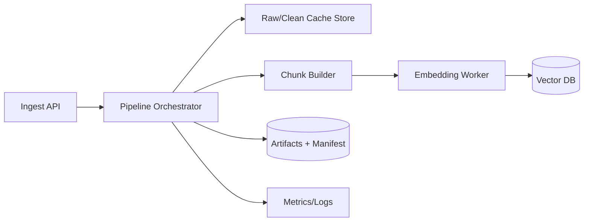

# Architecture – CleanerRawData Pipeline

Tài liệu này mô tả kiến trúc tổng thể, data model và các quyết định thiết kế của pipeline.

---

## 1. High-level architecture

```mermaid
flowchart TB
    subgraph Input
        I1[Tên công ty]
        I2[Website URL]
    end

    subgraph Stage1[1. Search API - Perplexity]
        S1[Perplexity SDK<br/>client.search.create()<br/>query: company + website]
    end

    subgraph Stage2[2. Discover - FireCrawl Map]
        S2[POST /v1/map<br/>search: website URL<br/>limit: N]
    end

    subgraph Stage3[3. Crawl - FireCrawl]
        S3a[POST /v1/scrape<br/>formats: markdown]
        S3b[POST /v1/crawl<br/>limit, includePaths]
    end

    subgraph Stage4[4. Clean Markdown]
        S4[strip_markdown<br/>filter_blocks<br/>dedup_blocks]
    end

    subgraph Stage5[5. Rule-based Chunking]
        S5[Heading heuristic<br/>+ sentence split<br/>+ overlap by sentences]
    end

    subgraph Storage
        DB[(JSONL / Parquet<br/>+ optional VectorDB)]
    end

    I1 --> S1
    I2 --> S1
    I2 --> S2
    S1 -->|seed URLs + domains| S2
    S2 -->|filtered URLs| S3a
    S2 -->|filtered URLs| S3b
    S3a --> S4
    S3b --> S4
    S4 --> S5
    S5 --> DB
```


---

## 2. Data model giữa các bước

Tất cả model dùng **Pydantic v2** để validate.

```python
# app/models.py (khung)

from pydantic import BaseModel, HttpUrl
from datetime import datetime
from typing import Optional, Literal

class SeedURL(BaseModel):
    url: HttpUrl
    source: Literal["perplexity", "user_input", "manual_seed"]
    title: Optional[str] = None
    snippet: Optional[str] = None
    relevance: Optional[float] = None   # score tự gán (nếu cần)

class DiscoveredURL(BaseModel):
    url: HttpUrl
    domain: str
    discovered_via: Literal["firecrawl_map"]
    score: Optional[float] = None

class RawPage(BaseModel):
    url: HttpUrl
    title: Optional[str]
    markdown: str                       # raw markdown từ FireCrawl
    html: Optional[str] = None          # giữ lại nếu cần debug
    status_code: int
    crawled_at: datetime
    language: Optional[str] = None

class CleanedPage(BaseModel):
    url: HttpUrl
    title: Optional[str]
    text: str                            # plain text đã clean
    word_count: int
    language: Optional[str]
    crawled_at: datetime
    is_low_quality: bool = False         # True nếu quá ngắn sau clean

class Chunk(BaseModel):
    chunk_id: str
    section_heading: Optional[str]
    text: str
    source_url: HttpUrl
    page_title: Optional[str]
    word_count: int
    crawled_at: datetime
    chunk_index: int
```

### Vì sao tách `RawPage` và `CleanedPage`?

- **Debug & re-process**: khi đổi rule clean/chunk, không cần crawl lại (tốn quota FireCrawl).
- **Caching**: lưu `RawPage` theo hash để dedupe.
- **Audit**: so sánh trước/sau clean để đánh giá chất lượng.

---

## 3. Orchestrator (`app/pipeline.py`)

```python
async def run_pipeline(
    company: str | None = None,
    website: str | None = None,
    manual_seeds: list[str] | None = None,
    limit: int = 20,
    *,
    no_search: bool = False,
    include_subdomains: bool | None = None,
    map_limit: int | None = None,
    write_outputs: bool = True,
) -> PipelineResult:
    # Stage 1: seeds → Stage 2: map → Stage 3: scrape_many
    # Stage 4–5: clean + chunk; có thể ghi out/<slug>/…
```

Triển khai ở mức demo:

- Stage 1 dùng Perplexity Search API qua SDK (`client.search.create()`), Stage 2-3 dùng FireCrawl SDK.
- Stage 4, 5 chạy CPU-bound → có thể đẩy vào `asyncio.to_thread` hoặc process pool nếu volume lớn.
- Mỗi stage đều **idempotent + cache-able** theo input hash.

---

## 4. Quyết định thiết kế

### 4.1 Vì sao dùng Perplexity Search API ở bước 1?


| Phương án                 | Ưu điểm                                                   | Nhược điểm                              |
| ------------------------- | --------------------------------------------------------- | --------------------------------------- |
| Seed URL thủ công         | Đơn giản, minh bạch                                       | Coverage thấp nếu chỉ có ít URL đầu vào |
| Search API thường         | Kết quả thuần, dễ kiểm soát                               | Cần tự lọc nhiều URL nhiễu              |
| **Perplexity Search API** | Tập trung cho web search, trả URL nhanh để bootstrap seed | Vẫn cần lọc domain và verify URL        |


Chọn Perplexity Search API để bootstrap seed URLs nhanh khi đầu vào chỉ có tên công ty hoặc website chưa đầy đủ.

> **Mitigation:** verify mỗi URL từ kết quả search có HTTP 200 + thuộc domain hợp lệ trước khi đẩy sang stage 2.

### 4.2 Vì sao FireCrawl `/map` thay vì tự crawl sitemap?

- `/map` đã gộp cả `sitemap.xml`, internal links và chỉ cần **search theo URL thường** (`search` param).
- Trả về list URL nhanh (vài giây) – đủ dùng cho demo, không cần dựng worker.
- Có thể filter bằng `includeSubdomains`, `limit` (search theo URL đầu vào).

### 4.3 Vì sao crawl sang Markdown?

- Markdown giữ được **cấu trúc heading** (H1/H2/H3) → giúp chunker bám section, không cắt giữa heading.
- Loại bỏ phần lớn HTML noise (script, style, attribute) ngay từ FireCrawl.
- Dễ dàng convert sang plain text với rule đơn giản hơn rất nhiều so với HTML.

### 4.4 Pipeline clean Markdown (theo cleaner hiện tại)

Thứ tự xử lý:

1. `**strip_markdown`**:
  - Xoá HTML tags, image markdown, linked-image, bare URL.
  - Unwrap hyperlink (`[text](url)` -> `text`).
  - Bỏ markdown markers (`#`, `>`, backticks, code blocks).
  - Normalize whitespace.
2. `**filter_blocks**`:
  - Tách block theo `\n\n`.
  - Loại nav blocks bằng heuristic (`>=60%` dòng ngắn).
  - Loại line match boilerplate regex (EN + VI).
3. `**dedup_blocks**`:
  - Dedupe paragraph theo key chuẩn hoá (`lowercase + collapse spaces`).

### 4.5 Vì sao dùng Rule-based Chunking (heading + sentence overlap)?


| Cách                                        | Ưu                                           | Nhược                              |
| ------------------------------------------- | -------------------------------------------- | ---------------------------------- |
| Fixed-size (500 words/tokens)               | Đơn giản, nhanh                              | Cắt giữa câu, mất ngữ cảnh         |
| **Rule-based (heading + sentence overlap)** | Bám cấu trúc web tốt, chi phí thấp, dễ debug | Heading heuristic có thể nhận nhầm |
| Semantic (embedding-based)                  | Cắt theo chuyển ý tốt hơn                    | Tốn chi phí và độ phức tạp         |


Chọn Rule-based làm mặc định cho MVP để pipeline chạy ổn định, rẻ và dễ debug.

Luật cắt hiện tại:

- Detect section heading theo heuristic (2-15 từ, viết hoa đầu dòng, không kết thúc dấu câu).
- Tách body thành câu bằng regex đơn giản.
- Tích luỹ đến `CHUNK_MAX_WORDS=400` thì tạo chunk.
- Giữ overlap `OVERLAP_SENTENCES=2` cho chunk kế tiếp.
- Chunk ngắn hơn `CHUNK_MIN_WORDS=15` thì merge vào chunk trước hoặc bỏ.

---

## 5. Error handling & retry


| Stage            | Loại lỗi                                | Xử lý                                              |
| ---------------- | --------------------------------------- | -------------------------------------------------- |
| Perplexity       | 429 / 5xx                               | Retry exponential backoff (3 lần, base 2s).        |
| Seed URL input   | URL không hợp lệ                        | Normalize + validate bằng `HttpUrl`, reject sớm.   |
| FireCrawl map    | Empty result                            | Fallback: dùng trực tiếp các seed URL hợp lệ.      |
| FireCrawl scrape | Timeout / 4xx                           | Skip URL, ghi log, tiếp tục các URL khác.          |
| Clean markdown   | Trang quá ngắn (<50 từ)                 | Đánh dấu `quality=low`, skip khỏi chunking.        |
| Chunking         | Heading detect hoặc sentence split lệch | Merge chunk ngắn + fallback split theo word count. |


---

## 6. Observability

- **Structured logging** (`structlog` hoặc `loguru`):
  - Mỗi stage log `{stage, input_id, duration_ms, output_count}`.
- **Metrics** (sau demo):
  - `pipeline_pages_crawled_total`
  - `pipeline_chunks_total`
  - `pipeline_stage_duration_seconds{stage=...}`
- **Trace ID**: mỗi lần chạy gắn `run_id = uuid4()` xuyên suốt 5 stage.

---

## 7. Bảo mật & rate limit

- API keys load từ `.env`, **không hard-code**.
- Dùng SDK clients:
  - Perplexity qua Search API SDK (`client.search.create`)
  - FireCrawl qua `FirecrawlApp(api_key=...)`
- Bọc call SDK bằng timeout/retry ở service layer.
- Throttle FireCrawl (mặc định free tier ~5 req/s) bằng `asyncio.Semaphore`.
- Tôn trọng `robots.txt` ở stage Map (FireCrawl đã handle, vẫn cần check).

---

## 8. Testing strategy

- **Unit test** cho mỗi stage với SDK mocks (mock Perplexity/FireCrawl client methods).
- **Golden test** cho `clean_markdown`: nhập markdown mẫu → so sánh output với file `.expected.txt`.
- **Integration test** end-to-end với 1 domain nhỏ + record cassette (`vcrpy`).

---

## 9. Phase 9 Architecture (sau demo)

Mục tiêu phase này: chuyển từ pipeline demo sang ingest service cho RAG production với incremental update + vector indexing.

### 9.1 Logical components




- **Ingest API**: nhận request ingest, validate input, cấp `run_id`.
- **Pipeline Orchestrator**: dùng lại stage 1-5 hiện tại, thêm logic incremental.
- **Cache Store**: lưu `url`, `content_hash`, `last_crawled_at`, `status`.
- **Embedding Worker**: đọc chunk delta, tạo embedding theo batch.
- **Vector DB**: upsert theo `chunk_id`, hỗ trợ metadata filter.

Baseline stack đã chốt:

- PostgreSQL `16` + `pgvector` (metadata + vectors cùng một DB).
- Redis `7.x` (queue + cache).
- Embedding model: OpenAI `text-embedding-3-small`.
- Worker concurrency: `2` (ưu tiên ổn định và chi phí).

Lưu ý triển khai:
- Docker Compose chỉ dựng hạ tầng.
- Schema metadata phải được quản lý bằng migration (Alembic), không tạo thủ công trên môi trường chạy thật.

### 9.2 Data contracts mới

- `**manifest.json`**
  - `run_id`, `pipeline_version`, `input`, `started_at`, `finished_at`, `stats`.
- `**delta.json**`
  - `new_urls`, `changed_urls`, `unchanged_urls`, `removed_urls`.
- `**embeddings.jsonl**`
  - `chunk_id`, `embedding_model`, `dim`, `vector_checksum`, `upsert_status`.

### 9.3 Incremental strategy

1. Tính `content_hash` trên cleaned text (hoặc markdown nếu muốn nhạy hơn).
2. So sánh với snapshot lần chạy gần nhất theo `normalized_url`.
3. Nếu bật `FIRECRAWL_SKIP_SCRAPE_FOR_KNOWN_URLS`, skip scrape cho URL đã có snapshot + cache.
4. Chỉ chunk + embed cho trang mới hoặc thay đổi.
5. Upsert vector theo `chunk_id`; xóa/disable vector cũ nếu URL bị remove.

Chính sách lifecycle đã chốt:

- URL remove khỏi source: đánh dấu inactive, không xóa ngay.
- TTL expire: `7 ngày`, hết TTL mới hard delete vector/record.

### 9.4 API boundary đề xuất

- `POST /ingest`
  - body: `company`, `website`, `manual_seeds`, `limit`, `dry_run`.
  - response: `run_id`, `status_url`.
- `GET /jobs/{run_id}`
  - trả `status`, `stage`, `progress`, `stats`, `errors`.
- `POST /ingest/reindex`
  - chạy lại chunk+embedding từ cleaned cache, không scrape lại.

### 9.5 Non-functional requirements

- **Idempotency**: request có cùng `run_key` không tạo job trùng.
- **Backpressure**: queue giới hạn số job chạy song song theo quota.
- **Retry policy**: retry có phân loại theo lỗi transient/permanent.
- **Cost guardrails**: hard limit số URL scrape / run + token budget cho embedding.

Thông số RAG baseline:

- `CHUNK_MAX_WORDS=220`
- `CHUNK_MIN_WORDS=50`
- `CHUNK_OVERLAP_SENTENCES=2`

---

## 10. Phase 10 Architecture – MindMap Builder (vector → tree → OPML)

> Đặc tả chi tiết: [`MINDMAP.md`](MINDMAP.md). Kế hoạch triển khai: [`IMPLEMENTATION_PLAN.md`](IMPLEMENTATION_PLAN.md) §Phase 10.

### 10.1 Logical components

```mermaid
flowchart LR
    A["pgvector: rag_chunks<br/>(notebooklm_id + chunk_text)"] --> B[Vector Loader]
    B --> C[UMAP + HDBSCAN]
    C --> D[Topic Extractor (LLM)]
    D --> E[Recursive Clusterer]
    E --> F[NER (spaCy/LLM)]
    F --> G[Tree Builder + roll-up]
    G --> H[Synthesizer (LLM)]
    H --> I[OPML Exporter]
    H --> J[(mindmap_runs)]
    I --> K["Artifacts<br/>mindmap.json + .opml"]
```

- **Vector Loader**: scope theo `by_website` (default), `by_run_id`, `by_chunk_ids` và luôn filter `notebooklm_id`.
- **Clusterer**: UMAP `1536→8` cosine, HDBSCAN top-level + recursive.
- **Topic Extractor**: LLM `gpt-4o-mini`, prompt strict JSON, dùng top-K chunk gần centroid.
- **NER**: spaCy `xx_ent_wiki_sm` mặc định cho leaf; LLM-NER là tuỳ chọn.
- **Tree Builder**: ráp JSON tree, citation = `chunk_ids` (roll-up từ leaf lên root).
- **Synthesizer**: LLM viết description ngắn cho mỗi node (skip được).
- **OPML Exporter**: OPML 2.0 với attribute `_chunkIds` để link ngược.

### 10.2 Data contracts mới

- `**mindmap.json**`: tree node có `id`, `title`, `summary`, `description`, `chunk_ids`, `entities`, `children`.
- `**mindmap.opml**`: OPML 2.0, có `_chunkIds` attribute.
- `**manifest.json**` (mindmap): `mindmap_run_id`, params, stats, stage durations.
- DB `**mindmap_runs**`: `mindmap_run_id` (PK), `ingest_run_id` FK, `notebooklm_id`, `scope_mode`, `status`, counts, `params`.
- DB `**rag_chunks**`: thêm `notebooklm_id` (NOT NULL) và `chunk_text` để topic/NER đọc trực tiếp từ DB.

### 10.3 Quyết định thiết kế

#### 10.3.1 Tại sao UMAP trước HDBSCAN?

| Phương án                        | Ưu                                            | Nhược                                              |
| -------------------------------- | --------------------------------------------- | -------------------------------------------------- |
| HDBSCAN trực tiếp 1536-dim       | Đơn giản                                      | Curse-of-dimensionality, mọi điểm gần nhau         |
| **UMAP `1536→8` rồi HDBSCAN**    | Cluster sạch, ổn định, reproducible           | Thêm 1 dependency, cần `random_state` để reproduce |
| PCA → KMeans                     | Nhanh                                         | Phải chốt số cluster trước, không có noise label   |

Chọn UMAP+HDBSCAN vì cho noise label rõ (nhánh "Misc / Unclustered") và không cần biết trước số cluster.

#### 10.3.2 Tại sao recursive cluster thay vì 1 lần phẳng?

- Mindmap cần phân cấp (root → branch → sub-branch → leaf).
- Recursive cho phép sub-branch phản ánh nuance ngữ nghĩa con của 1 chủ đề lớn.
- HDBSCAN chạy lại trên subset thường tách được sub-cluster rõ hơn nhờ scale-locality.

#### 10.3.3 Tại sao LLM cho topic name + synthesis nhưng spaCy cho NER?

- **Topic + synthesis**: cần ngôn ngữ tự nhiên, gọn, có sense → LLM rất phù hợp, gọi ít lần (≈ số node).
- **NER**: gọi mỗi leaf → tổng số call lớn, spaCy offline đủ tốt cho ORG/LOC/PER và rẻ hơn nhiều.
- LLM-NER vẫn để như tuỳ chọn `MINDMAP_NER_PROVIDER=llm` cho domain tiếng Việt khó.

#### 10.3.4 Tại sao OPML thay vì FreeMind / SVG?

- OPML 2.0 là format text, dễ generate, dễ diff git.
- XMind, Logseq, MarkMap, Workflowy đều import được.
- Cho phép gắn metadata custom (`_chunkIds`) mà không phá format.

### 10.4 Idempotency & reproducibility

- UMAP `random_state=42` cố định → cluster top-level reproducible.
- HDBSCAN deterministic theo cùng input.
- LLM topic + synthesis có nhiệt độ thấp (`0.2`) → vẫn có nhiễu nhỏ giữa các lần build (không reproducible 100% phần text).
- `mindmap_run_id` mới mỗi lần build, nhưng có thể reuse `ingest_run_id` để diff giữa các lần build.

### 10.5 Cost & guardrails

- Token budget `MINDMAP_MAX_TOKENS_PER_RUN` áp cứng (mặc định 200k).
- `dry_run=true` chỉ load vectors + estimate, không gọi LLM.
- Hard limit `MAX_VECTORS_PER_RUN=10000`.
- Cost summary trả trong API response giống Phase 9 (`topic_calls`, `synthesis_calls`, `estimated_tokens`, `estimated_cost_usd`).

### 10.6 Multi-run merge policy (đã chốt)

- Đơn vị isolation là `notebooklm_id` (không phải `website`).
- Build mặc định theo active set:
  - `WHERE notebooklm_id = :notebooklm_id AND is_active = true`.
- `by_run_id` chỉ dùng cho audit/reproducibility, vẫn bắt buộc cùng `notebooklm_id`.

