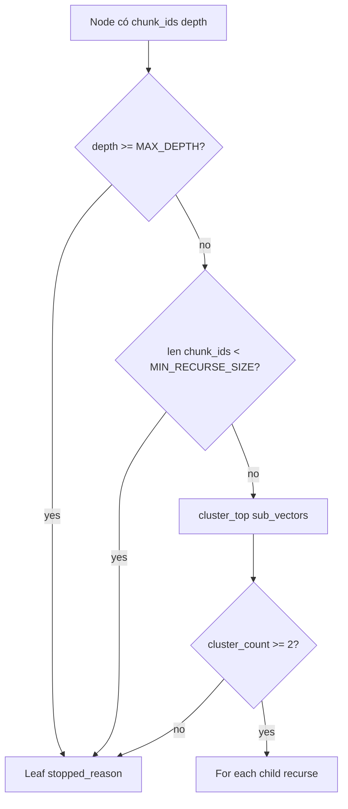

# Phân cụm đệ quy (Recursive Clustering) — Thiết kế & kế hoạch vận hành

Tài liệu mô tả **cách hệ thống Phase 10 bẻ nhánh cây mindmap** từ vector embedding: **HDBSCAN tầng top** kết hợp **HDBSCAN đệ quy** trong từng cụm lớn. Bám implementation trong [`app/mindmap/recursive_cluster.py`](../app/mindmap/recursive_cluster.py) và [`app/mindmap/clusterer.py`](../app/mindmap/clusterer.py). Đọc thêm tổng quan pipeline tại [`MINDMAP.md`](MINDMAP.md) và [`PIPELINE.md`](PIPELINE.md).

---

## 1. Mục đích nghiệp vụ

- **Vấn đề:** Một cluster top-level (ví dụ nhánh “Digital Transformation Services”) có thể gom **hàng trăm chunk** — nếu chỉ một node duy nhất, mindmap thiếu chiều sâu, khó đọc cho team M&S hoặc stakeholder.
- **Mục tiêu:** **Bẻ gãy** một nhánh gốc (root branch) thành **nhiều sub-branch** và tiếp tục sâu khi cần, tạo phân cấp tự nhiên:

  `root → branch (top cluster) → sub-branch → … → leaf`

- **Leaf** trong code hiện tại là node **không** sinh thêm con (dừng vì điều kiện độ sâu / kích thước / không tách được / noise bucket).

---

## 2. Vị trí trong pipeline Phase 10

| Bước | Artifact / stage | Vai trò |
|------|------------------|---------|
| C2 | `clusters_top.json` | **Một lần** HDBSCAN trên toàn bộ vector của scope → các cluster `label` 0…K và `noise_chunk_ids`. |
| C4 | `clusters_tree_raw.json` | **Cây:** mỗi nhánh top (`root_c{label}`) được **đệ quy** gọi lại `cluster_top` trên vector con để tạo `root_c0_c1`, … |

Topic naming (C3 / `topics.json`) hiện chủ yếu gắn **cluster top-level** (`cluster_{label}`); node sâu trong cây có thể chưa có topic LLM riêng — xem [§4.1b `MINDMAP_MARKETING_ANALYTICS_PLAN.md`](MINDMAP_MARKETING_ANALYTICS_PLAN.md) nếu cần đặt tên đa tầng.

---

## 3. Luồng thuật toán (đúng code)

### 3.1 Tầng top (`build_clusters_tree_raw_payload`)

1. Gọi `cluster_top(loaded.vectors, chunk_ids=loaded.chunk_ids, reduced=None)` với **tham số top** mặc định (UMAP + HDBSCAN theo [`clusterer.py`](../app/mindmap/clusterer.py)).
2. Với mỗi cluster thật (`label >= 0`), tạo con đầu tiên của cây với `node_id = "root_c{label}"`, `depth = 1`, `chunk_ids` = các chunk thuộc cluster đó.
3. Nếu có noise top-level: thêm node `root_n` (`cluster_label: -1`, `stopped_reason: "noise_bucket"`).
4. Root tổng hợp: `node_id: "root"`, `depth: 0`, `chunk_ids` = toàn bộ vector trong run.

### 3.2 Đệ quy trong cụm (`_build_subtree`)

Với mỗi node đang xét (đã có tập `chunk_ids` và `depth`):

1. **Dừng ngay — `max_depth`:** nếu `depth >= MINDMAP_MAX_DEPTH` → `stopped_reason: "max_depth"`, không con, **leaf**.
2. **Dừng ngay — quá nhỏ:** nếu `len(chunk_ids) < MINDMAP_MIN_RECURSE_SIZE` → `stopped_reason: "min_recurse_size"`, **leaf**.
3. **Lấy vector con:** map `chunk_ids` → hàng tương ứng trong `LoadedVectors`, gọi `cluster_top(sub_vectors, …, params=_sub_cluster_params())`.
   - Tham số con (**sub**) khác top: UMAP `n_neighbors` = `MINDMAP_SUB_N_NEIGHBORS`, HDBSCAN `min_cluster_size` / `min_samples` = `MINDMAP_SUB_*` (xem §5).
4. **Không tách được:** nếu `cluster_count < 2` (chỉ còn một cụm “thật” + noise hoặc toàn noise theo metric) → `stopped_reason: "no_split"`, **leaf**.
5. **Có tách:** với mỗi cluster con `label`, tạo `node_id = "{parent}_c{label}"`, `depth + 1`, gọi đệ quy `_build_subtree`.
6. **Noise của tầng sub:** nếu `sub_result.noise_chunk_ids` không rỗng → thêm node con đặc biệt `node_id = "{parent}_n"`, `cluster_label: -1`, `stopped_reason: "noise_bucket"` (bucket noise **tầng đó**, không đệ quy thêm).

Như vậy **mỗi tầng** có thể sinh nhiều nhánh con theo mật độ local; noise được **gom** vào nhánh `_n` để không mất chunk khỏi cây.

### 3.3 Quy ước `node_id`

| Mẫu | Ý nghĩa |
|-----|---------|
| `root` | Gốc toàn tập |
| `root_c3` | Nhánh top cluster label 3 |
| `root_c3_c1` | Sub-cluster label 1 bên trong `root_c3` |
| `root_c3_n` | Noise của lần phân cụm trong nhánh `root_c3` |

`cluster_label` trên node lưu **label HDBSCAN tại tầng cha trực tiếp** (hoặc `-1` cho noise bucket).

---

## 4. Sơ đồ quyết định (tóm tắt)

---

## 5. Tham số cấu hình (env / `app/config.py`)

| Biến | Mặc định (tham khảo) | Ý nghĩa |
|------|---------------------|---------|
| `MINDMAP_MAX_DEPTH` | 3 | Giới hạn độ sâu cây; kiểm soát chi phí LLM topic sau này + độ phức tạp UI. |
| `MINDMAP_MIN_RECURSE_SIZE` | 12 | Cụm nhỏ hơn không chạy thêm HDBSCAN con. |
| `MINDMAP_SUB_MIN_CLUSTER_SIZE` | 3 | `min_cluster_size` HDBSCAN **tầng con**. |
| `MINDMAP_SUB_MIN_SAMPLES` | 2 | `min_samples` tầng con. |
| `MINDMAP_SUB_N_NEIGHBORS` | 8 | UMAP `n_neighbors` **chỉ** cho params sub (ghi đè trong `_sub_cluster_params`). |
| `MINDMAP_SMALL_N_THRESHOLD` | 20 | Dùng chung trong `cluster_top`: N nhỏ có thể bỏ UMAP, cosine trực tiếp. |

Tham số **top-level** HDBSCAN/UMAP: `MINDMAP_HDBSCAN_*`, `MINDMAP_UMAP_*` (không lặp lại đầy đủ ở đây — xem `clusterer.py` / `reducer.py`).

---

## 6. Artifact & metrics

File [`clusters_tree_raw.json`](../out/...) (theo `mindmap_run_id`) gồm:

- `tree`: object gốc đệ quy như trên.
- `params.top` / `params.sub` / `params.limits`: snapshot tham số để tái hiện.
- `metrics`: `vector_count`, `top_cluster_count`, `tree_node_count`, `tree_leaf_count`, `tree_max_depth`, v.v.

Các `stopped_reason` hữu ích cho debug: `max_depth`, `min_recurse_size`, `no_split`, `noise_bucket`.

---

## 7. Rủi ro & hướng tinh chỉnh

| Rủi ro | Gợi ý |
|--------|--------|
| Cây quá “ngẫu nhiên” so với luồng suy nghĩ M&S | Điều chỉnh `MINDMAP_SUB_*` / `MIN_RECURSE_SIZE`; hoặc lộ trình **guided tree** (tài liệu chiến lược: [`MINDMAP_MARKETING_ANALYTICS_PLAN.md`](MINDMAP_MARKETING_ANALYTICS_PLAN.md) §4.1b / §6). |
| Quá nhiều noise ở tầng sub | Tăng `SUB_MIN_CLUSTER_SIZE` hoặc xem lại UMAP local; chấp nhận bucket `_n`. |
| Chi phí / độ trễ topic đa tầng | Giữ `MAX_DEPTH` thấp; topic LLM chỉ cho top-level cho đến khi có ngân sách. |

---

## 8. Kiểm thử gợi ý

- Smoke C4: [`examples/check_phase10_c4.py`](../examples/check_phase10_c4.py) — sinh `clusters_tree_raw.json`, kiểm `tree_max_depth`, `tree_leaf_count`.
- So khớp: tổng `chunk_ids` ở các leaf (cộng dồn qua union từ root) phải khớp `vector_count` (logic assert nằm ở [`tree_builder.py`](../app/mindmap/tree_builder.py) khi ghép mindmap).

---

## 9. Phiên bản tài liệu

| Phiên bản | Ngày | Ghi chú |
|-----------|------|---------|
| 1.0 | 2026-05-04 | Bản đầu — mô tả recursive HDBSCAN theo code hiện tại |
