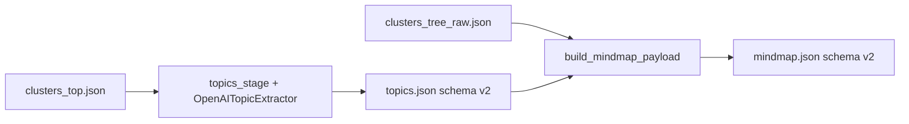

# Kế hoạch thực thi — Mục 4.1: Mở rộng contract LLM topic (Marketing & Sales)

Tài liệu này chi tiết hoá [§4.1 trong `MINDMAP_MARKETING_ANALYTICS_PLAN.md`](MINDMAP_MARKETING_ANALYTICS_PLAN.md). Dùng làm checklist triển khai trong code; bám implementation hiện tại Phase 10 (C3 → `topics.json` → D1 → `mindmap.json`).

---

## 1. Phạm vi

**Trong phạm vi**

- Mở rộng **một** lần gọi LLM (`OpenAITopicExtractor`) để trả thêm `swot_category`, `funnel_stage`, và `ms_notes`.
- Ghi các field vào `topics.json` (schema bump).
- Đưa các field vào từng node trong `mindmap.json` (schema bump), kèm **giá trị mặc định** cho node không có topic LLM.

**Ngoài phạm vi** (làm ở work item khác)

- §4.1b — Topic đa tầng cho toàn bộ `node_id` trong cây đệ quy.
- §4.2 — OPML, `_actionPriority`, từ điển keyword.
- Feature flag môi trường (chỉ thêm nếu sau review thật sự cần tắt/bật tính năng).

---

## 2. Luồng dữ liệu sau khi triển khai

**Lưu ý:** Metadata M&S do LLM chỉ sinh tại C3 cho từng cluster top-level (`cluster_0`, `cluster_1`, …). Nhánh `cluster_noise` không gọi LLM — gán tĩnh. Root và các node con **chưa** có entry trong `topics.json` nhận default thống nhất (mục 5).

---

## 3. Contract dữ liệu

### 3.1 Enum bắt buộc (chuỗi canonical để consumer filter)

| Field | Giá trị cho phép |
|-------|------------------|
| `swot_category` | `Strength`, `Weakness`, `Opportunity`, `Threat`, `Mixed`, `N_A` |
| `funnel_stage` | `Awareness`, `Consideration`, `Decision`, `Retention`, `Unknown` |

### 3.2 `ms_notes`

- Kiểu: chuỗi.
- Một câu ngắn, góc nhìn M&S bổ sung cho `summary` (không thay thế `summary`).
- Parser: `strip`; có thể cắt an toàn nếu vượt ngưỡng độ dài (ví dụ ~200 ký tự) để tránh response quá dài.

### 3.3 Phiên bản artifact

| File | `schema_version` |
|------|------------------|
| `topics.json` | `2` |
| `mindmap.json` | `2` |

Consumer đọc `schema_version: 1` cần migrate khi chuyển sang bản mới.

---

## 4. Thay đổi theo file

### 4.1 [`app/mindmap/topic_extractor.py`](app/mindmap/topic_extractor.py)

1. Mở rộng `TopicPayload` (dataclass): thêm `swot_category`, `funnel_stage`, `ms_notes`.
2. Định nghĩa tập literal / frozen set cho SWOT và funnel.
3. `_parse_topic_json`:
   - Đọc `title`, `summary` như hiện tại (vẫn bắt buộc, không rỗng).
   - Đọc `swot_category`, `funnel_stage`, `ms_notes`; **chuẩn hoá** giá trị LLM (trim, map không phân biệt hoa thường → canonical).
   - Giá trị không khớp enum → fallback: `Mixed` hoặc `Unknown` hoặc `N_A` tùy field; `ms_notes` thiếu → `""`.
4. `extract_topic` — cập nhật **system prompt**:
   - Vai trò: cluster từ nội dung website / tài liệu invest; góc nhìn **marketing & sales**.
   - JSON strict kèm đủ key; chỉ chọn enum đã liệt kê.
   - `summary`: giữ quy tắc cũ (1 câu, giới hạn từ).
5. Vòng retry 2 lần: dòng append user phải liệt kê **đầy đủ** key (`title`, `summary`, `swot_category`, `funnel_stage`, `ms_notes`), không chỉ `title` và `summary`.

### 4.2 [`app/mindmap/topics_stage.py`](app/mindmap/topics_stage.py)

1. Root payload: `"schema_version": 2`.
2. **Dry-run:** Mỗi entry có đủ field M&S (placeholder, ví dụ `N_A`, `Unknown`, `ms_notes` rỗng hoặc một dòng giải thích dry-run).
3. Sau mỗi `extract_topic`: serialise đầy đủ field từ `TopicPayload` vào dict entry.
4. **`cluster_noise`:** không LLM — ví dụ `swot_category: N_A`, `funnel_stage: Unknown`, `ms_notes: ""`; giữ `llm_meta` deterministic.

### 4.3 [`app/mindmap/tree_builder.py`](app/mindmap/tree_builder.py)

1. Root output: `"schema_version": 2`.
2. Trong `_build`, sau `topic = _topic_for_node(...)`:
   - Nếu topic dict có key M&S: copy vào node (hoặc merge với default cho key thiếu lẻ).
   - Nếu không có topic (root, node con, hoặc thiếu key): áp default mục 5.
3. Đảm bảo **mọi** node có cùng bộ key (`swot_category`, `funnel_stage`, `ms_notes`) để schema ổn định.

### 4.4 [`app/mindmap/__init__.py`](app/mindmap/__init__.py)

- `TopicPayload` đổi shape — vẫn export public nếu đang re-export.

---

## 5. Giá trị mặc định (node không có topic LLM)

Áp dụng cho: `root`, mọi node con chưa có entry trong `topics.json`, và trường hợp topic dict thiếu field.

| Field | Default |
|-------|---------|
| `swot_category` | `N_A` |
| `funnel_stage` | `Unknown` |
| `ms_notes` | `""` |

`cluster_noise` trong `topics.json` nên khớp tinh thần “không phân loại được” (`N_A` / `Unknown`), không bắt buộc trùng byte-by-byte với default node — nhưng nên **nhất quán** trong một run.

---

## 6. Kiểm thử và nghiệm thu

| Bước | Việc làm |
|------|----------|
| C3 | Chạy [`examples/check_phase10_c3.py`](examples/check_phase10_c3.py) (có/không `--dry-run`): `topics.json` có `schema_version: 2` và đủ field mỗi cluster. |
| D1 | Chạy [`examples/check_phase10_d1.py`](examples/check_phase10_d1.py) với `clusters_tree` + `topics` mới: `mindmap.json` có `schema_version: 2`, mọi node có SWOT/funnel/ms_notes. |
| Regress | Assert coverage `chunk_ids` root không đổi so với trước (logic rollup không sửa). |

---

## 7. Rủi ro và mitigations

| Rủi ro | Cách xử lý |
|--------|------------|
| LLM trả giá trị ngoài enum | Chuẩn hoá + fallback; chỉ fail retry khi thiếu/không parse được `title`/`summary`. |
| Output token tăng | Giữ `ms_notes` một câu; không tăng số round-trip API. |
| Breaking consumer | Bump `schema_version` + ghi chú trong docs chính. |

---

## 8. Cập nhật tài liệu gốc

Sau khi merge code: cập nhật một trong hai (tránh lệch contract):

- [`docs/MINDMAP.md`](docs/MINDMAP.md) §4 (schema tree node + `topics.json`), **hoặc**
- Thêm dòng “Schema v2” ngắn trong [`MINDMAP_MARKETING_ANALYTICS_PLAN.md`](MINDMAP_MARKETING_ANALYTICS_PLAN.md) trỏ tới các field mới.

---

## 9. Checklist triển khai (thứ tự)

1. [ ] `topic_extractor.py`: `TopicPayload`, enum, `_parse_topic_json`, prompt + retry.
2. [ ] `topics_stage.py`: `schema_version` 2, dry-run, noise, persist fields.
3. [ ] `tree_builder.py`: `schema_version` 2, merge + defaults.
4. [ ] `__init__.py` export (nếu cần).
5. [ ] Smoke C3 / D1.
6. [ ] Cập nhật `MINDMAP.md` hoặc plan doc (mục 8).

---

## 10. Phiên bản tài liệu

| Phiên bản | Ngày | Ghi chú |
|-----------|------|---------|
| 1.0 | 2026-05-04 | Kế hoạch thực thi §4.1 — file độc lập |
